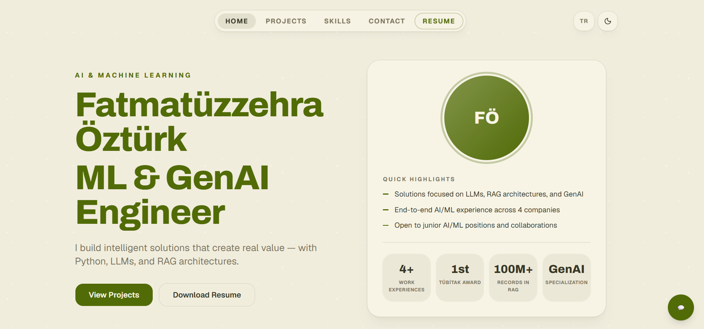

# Zehra Öztürk — Portfolio

Personal portfolio built with Next.js, featuring an AI assistant that answers questions about me.

**🔗 Live:** https://portfolyo-silk-beta.vercel.app

## Screenshots

| Home | AI Chat |
| --- | --- |
|  |  |

## Features

- Bilingual — English & Turkish (`/en`, `/tr`)
- AI chat widget that answers questions about my experience and projects (Groq + Vercel AI SDK)
- Experience, projects, skills and contact sections
- Responsive design with smooth reveal animations

## Tech Stack

Next.js 16 · React 19 · TypeScript · Tailwind CSS 4 · Vercel AI SDK · Groq

## Running Locally

```bash
npm install
cp .env.example .env.local   # add your GROQ_API_KEY (optional, only needed for the chat widget)
npm run dev
```

Open [http://localhost:3000](http://localhost:3000) in your browser.
